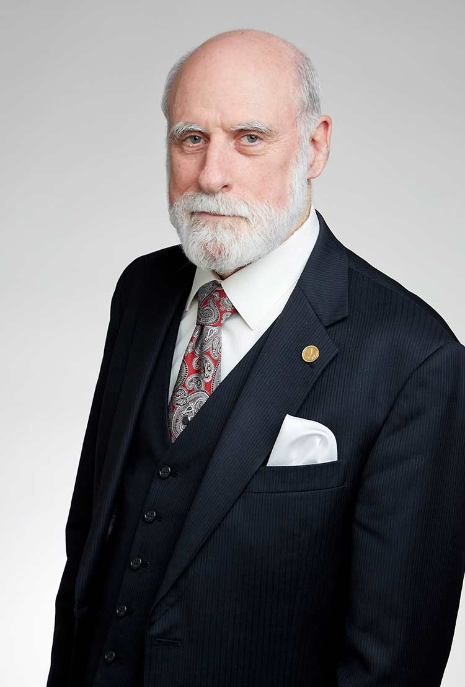

温顿·瑟夫（Vinton G. Cerf，1943年6月23日 - ），美国计算机科学家，因其与罗伯特·卡恩在「互联网络领域的开创性工作，包括设计和实现互联网基本通信协议TCP/IP，以及在网络领域展现的卓越领导力」，两人共同获得2004年图灵奖，两人被公认为是互联网之父。

温顿·瑟夫于1943年6月23日出生在美国康涅狄格州纽黑文，他从小就患有听力障碍，后来他将对计算机的兴趣部分归因于其作为听障者替代通信渠道的潜力。

1965年，获得加利福尼亚州斯坦福大学数学学士学位。毕业后曾在 IBM 工作2年，担任系统工程师，参与了基于 FORTRAN 的分时系统 Quicktran 的开发，这激发了他对计算机科学的兴趣。后来他离开IBM进入加州大学洛杉矶分校（UCLA），分别于1970年和1972年获得计算机科学硕士和博士学位。

在 UCLA  瑟夫在伦纳德·克莱因罗克的实验室工作，瑟夫和他的同学斯蒂芬·克罗克合作，为 ARPANET 共同参与编写通信协议，这个协议成为首个基于计算机网络的分组交换技术。UCLA 也是最初的四个 ARPANET 节点之一。瑟夫还参与了用于测量和测试 ARPANET 性能的软件开发。

1969年，卡恩来到 UCLA 协助测试新兴的 ARPANET时，瑟夫与卡恩建立了有效的合作关系，共同生成测试数据并预测和诊断网络中的问题，他们二人的关系是瑟夫整个职业生涯中最重要的关系之一。

博士毕业后，瑟夫回到斯坦福大学，加入计算机科学和电气工程系。

1972年，卡恩担任 DARRPA 信息处理技术办公室（IPTO）的项目经理，开始设想一个分组交换网络——本质上就是后来的互联网。卡恩已开始考虑将ARPA的分组无线电和卫星网络连接到ARPANET，但面临巨大挑战，因为这三个网络在技术上不兼容。ARPANET采用点对点传输，而无线电网络则采用广播;ARPANET 试图保证数据包的可靠传输，而 PRNET 则没有;而SATNET的传输延迟更长，因为数据包需要传输的距离较远。成功连接如此多样化的网络需要一种新的方法。1973年，卡恩联系当时在斯坦福大学任教的瑟夫，协助设计这个新网络。瑟夫和卡恩很快制定了他们称为 ARPA 互联网的初步版本，并于1974年联合发表了开创性论文《分组网络互通信协议》，概述了由此产生的互联网架构。

1976年，瑟夫加入卡恩负责的项目。1978年，瑟夫与南加州大学信息科学研究所的乔恩·波斯特尔和丹尼·科恩合作，将TCP重新表述为两类协议：主机协议（TCP）和独立的网络间协议（IP）。IP是一种简化的协议，用于在网络内部或网络间传递数据包，它能在主机和网关上运行。而更复杂的TCP仅在主机上运行，提供可靠的端到端服务。瑟夫在1980年的文章《互联分组网络协议》中描述了新的TCP/IP架构，简化了互联网网关的操作，并增加了连接互联网的网络数量和多样性。

瑟夫和卡恩监督了TCP的实施以及1977年ARPANET、PRNET和SATNET的实验性连接，这称为互联网的第一个化身。

1982年，瑟夫离开 DARPA转任 MCI 通信公司（1998年至2003年任职于 WorldCom 公司）副总裁，继续致力于将互联网作为公众可访问媒介。在 MCI 期间，他领导开发和部署了 MCI Mail，这是第一个连接到互联网的商业电子邮件服务。

1986年，瑟夫离开 MCI，期间曾任国家研究倡议公司副总裁，负责信息基础设施和数字图书馆工作。

1994年至2005年，瑟夫重返MCI，担任技术战略高级副总裁，负责从技术角度指导企业战略制定。2000年至2007年担任互联网名称与数字分配公司（ICANN）的董事会主席，该组织负责监督互联网的发展与扩展。

2005年，瑟夫离开MCI，成为谷歌公司的副总裁兼「熟悉互联网布道者」，他的职责包括寻找新技术，以及支持基于互联网的新型产品和服务的发展。

瑟夫和卡恩作为TCP/IP协议和互联网架构的共同设计者获得了很多荣誉。1997年12月，克林顿总统将美国国家技术奖章授予瑟夫和卡恩，以表彰他们创立和发展互联网。2004年，瑟夫和卡恩共同获得图灵奖。2005年11月，乔治·布什总统授予瑟夫和卡恩总统自由勋章，以表彰他们的工作，该奖章是美国授予其公民的最高平民荣誉。

## 参考资料
1. [百度百科-温顿·瑟夫](https://baike.baidu.com/item/%E6%B8%A9%E9%A1%BF%C2%B7%E7%91%9F%E5%A4%AB/707725?structureClickId=707725&structureId=ced913fd22dfe016c93805da&structureItemId=f490c020eb1a3c10c9bcc569&lemmaFrom=starMapContent_star&fromModule=starMap_content&lemmaIdFrom=324645)
2. [Britannica - Vinton Cerf](https://www.britannica.com/biography/Vinton-Cerf)
3. https://internethistory.org/bio/vint-cerf/
4. https://www.internethalloffame.org/vint-cerf/
5. https://amturing.acm.org/award_winners/cerf_1083211.cfm