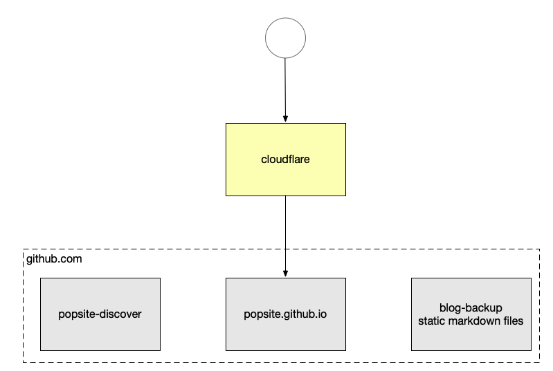
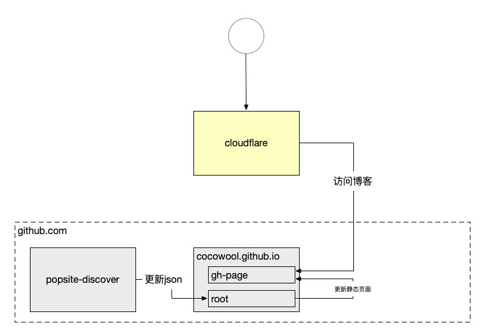

前一段时间因为新浪停止云服务，我把原来托管在SAE的静态博客搬到了 [Github Page](https://www.popsite.cn) 上。仍然是通过本地编辑文章上传的方式更新，原始的博客文章放在了一个 Github 仓库中作为备份。



大概是上图的这个结构，域名注册在阿里云，解析是在 cloudflare，页面托管在 cocowool.github.io 这个仓库，然后还有一个备份仓库，还有一个部分动态内容的仓库。

整个过程基本上是在大模型对话框的辅助下手工完成的，之所以没用本地的Agent，因为我还是希望对整个过程能有更多的了解，方便日后排查解决问题。我相信本地Agent一定可以完成这个任务，不确定的因素有2点：一方面不知道会花费多少Token，另一方面不知道会在本地安装配置什么内容。

```sh
# 使用 npx 安装 hexo 的最新版本并初始化项目
$ npx hexo-cli@latest init popsite-hexo
$ cd popsite-hexo
$ npm install
# 完成后检查版本信息
$ npx hexo version
INFO  Validating config
hexo: 8.1.2
hexo-cli: 4.3.2
os: darwin 21.3.0 12.2.1

node: 24.13.0
acorn: 8.15.0
ada: 3.3.0
amaro: 1.1.5
ares: 1.34.6
brotli: 1.1.0
cjs_module_lexer: 2.1.0
cldr: 47.0
icu: 77.1
llhttp: 9.3.0
modules: 137
napi: 10
nbytes: 0.1.1
ncrypto: 0.0.1
nghttp2: 1.67.1
openssl: 3.5.4
simdjson: 4.1.0
simdutf: 6.4.0
sqlite: 3.50.4
tz: 2025b
undici: 7.18.2
unicode: 16.0
uv: 1.51.0
uvwasi: 0.0.23
v8: 13.6.233.17-node.37
zlib: 1.3.1-470d3a2
zstd: 1.5.7
```

Hexo 安装成功后，可以生成文件看看有没有问题。
```sh
$ npx hexo clean
$ npx hexo generate
$ npx hexo server
```

我的站点用了一个自己开发的主题 [wave]()因为用到scss的语法，安装scss渲染器有问题，后来尝试安装了 Dart Sass 的版本，解决了样式编译问题。

```sh
$ npm install hexo-renderer-sass --save
```

现在，我整个博客文章保存和网站托管的工程结构变成了下面的样子，节省了一个代码仓库，看起来更简洁了。



Hexo 8 版本的速度确实提升了不少，从生成速度方面看，比原来的 Hexo 5 几乎快了一倍。但是具体的文件数量也有差异，也可能和某些配置没转移过去有关系，后续还要研究研究。

```sh
$ time hexo generate 
INFO  1100 files generated in 1.48 s
hexo generate  7.37s user 1.94s system 145% cpu 6.411 total

# 对比一下 hexo 5
$ time hexo generate
INFO  2013 files generated in 2.59 s
hexo generate  10.04s user 2.96s system 150% cpu 8.655 total
```

## 参考资料
1. [chat.qwen.ai](https://chat.qwen.ai)