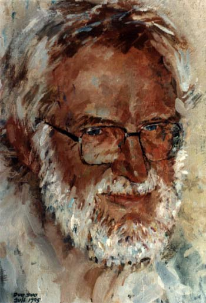

彼得·诺尔（Peter Naur，1928年10月25日 - 2016年1月3日），丹麦天文学家和计算机科学家，致力于计算机领域编程语言的研究，参与了编程语言 ALGOL 的开发，因其在编程语言设计以及Algol 60定义、编译器设计以及计算机编程艺术与实践方面的基础性贡献，获得2005年图灵奖。

1928年10月25日，彼得·诺尔出生于丹麦腓特烈斯堡。他的父亲是一位画家，他的母亲没有特定职业，但出身于富裕的商业家庭。

彼得·诺尔小时候对天文学很感兴趣，12岁的时候他已经开始阅读包括著名英国天文学家詹姆斯·简斯和亚瑟·爱丁顿的著作。德国在1940年到1945年期间占领了丹麦，这个期间丹麦的城市没有灯光，彼得可以坐在阳台上观星。15岁时，他已经写下了第一篇科学论文，还亲眼见过丹麦物理学家丹尼斯·玻尔。

彼得·诺尔刚开始在哥本哈根大学学习天文，于1948年完成学位。他完成一年的兵役后，在丹麦天文学家本特·斯特罗姆格伦的推荐下，彼得前往英国剑桥大学国王学院，进行天文学和新兴计算机编程领域的研究。

在剑桥，彼得·诺尔花费了大量时间编写电子延迟存储自动计算器（EDSAC）以解决天文学中的微扰问题。彼得编写的程序能够在20秒内计算出人工需要两小时的问题。

剑桥毕业后，彼得·诺尔前往美国进行天文学研究（1952-1953）。在美国，他结识了哈佛大学计算机先驱霍华德·艾肯和普林斯顿的约翰·冯·诺依曼，并学习了计算机的前沿技术。

1953年，彼得·诺尔返回丹麦。在五十年代末期，彼得·诺尔决定放弃天文学领域的研究，转而从事非学术的计算机编程工作。他加入了根本哈根计算中心 （丹麦语：Regnecentralen），他的新上司邀请他参与开发后来被称为 ALGOL 的编程语言。彼得·诺尔考察了瑞士、德国的 ALCOR 工作组，并于1959年在哥本哈根组织了一场会议。后来他创办了一本名为「ALGOL Bulletin」的讨论期刊，这本期刊迅速成为官方沟通媒介，彼得·诺尔无意间成为 ALGOL 背后的欧洲领军人物。

在20世纪60年代，彼得·诺尔在丹麦计算机学术领域的作用越来越重要。1966年，他将所教授的课程定义为「datalogi」，即一门数据科学，该属于已经被丹麦语和瑞典语采用。1966年，彼得·诺尔被任命为哥本哈根大学数学研究所教授，直到1999年他70岁时退休。

彼得·诺尔深受波普尔、奎因、罗素、赖尔等哲学家的影响，并借鉴哲学概念以深化对软件工程的理解。万年，他深入研究哲学、数理逻辑和规则方面的工作。

## 参考资料
1.[百度百科-彼得·诺尔](https://baike.baidu.com/item/%E5%BD%BC%E5%BE%97%C2%B7%E8%AF%BA%E5%B0%94/9787625?structureClickId=9787625&structureId=ced913fd22dfe016c93805da&structureItemId=508cb2fb814881169509eefe&lemmaFrom=starMapContent_star&fromModule=starMap_content&lemmaIdFrom=324645)
2.https://amturing.acm.org/award_winners/naur_1024454.cfm
3.https://www.naur.com/
