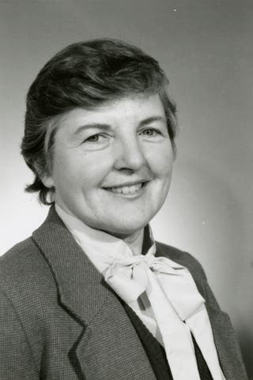

法兰西斯·艾伦（Frances Elizabeth Allen，1932年8月4日 - 2020年8月4日），美国计算机科学家，因其在优化编译器技术理论与实践方面的开创性贡献，获得2006年图灵奖，是图灵奖的第一位女性得主。

艾伦出生于1932年8月4日，在纽约附近的一个农场长大。她是家中六个孩子中的长女，她的父亲是一名农民，母亲是一名小学教师。

高中时，艾伦受到数学老师的启发，立志成为一名数学教师。经过在纽约州立师范学院（现为纽约州立大学奥尔巴尼分校）思念的学习，获得了数学学士学位。同时，她还辅修了物理和教育学。毕业后她进入同一所高中，教授初等代数和高级三角学等课程。

为了获取完全的教师资格，艾伦发现还需要硕士学位，她在哥伦比亚大学参加了一些暑期课程后，进入密歇根大学安娜堡分校，后来获得数学硕士学位。她还在那里选秀了计算机课程，并向 Bermard Galler 学习编程。这期间 IBM 在密歇根校园招聘，艾伦获得了研究工作的职位。她认为这样能够赚钱还清学生贷款，然后再回去教书，虽然此后她在IBM工作了45年。

艾伦于1957年7月15日加入IBM，正好在FORTRAN编程语言发布两个月后。她的第一个任务是教IBM内部的研究科学家如何使用该语言，并间接鼓励IBM客户使用。她做了教师常常必须做的事：比学生早几天学会课程内容。作为这一过程的一部分，她阅读了由约翰·巴克斯（后来成为图灵奖得主）及其团队开发的FORTRAN编译器的源代码。用她的话说，“这激发了我对编译的兴趣，也影响了我对编译器的看法，因为它的组织方式直接源自现代编译器。”

艾伦职业生涯的大部分时间都在为 IBM 研究院开发前沿编程语言编辑器，她的第一个重要项目是 Stretch/Harvest 计算机。Stretch是最早的超级计算机之一，Harvest是Stretch的协处理器，最初为美国国家安全局（NSA）设计，用于破译秘密信息。艾伦和她的团队设计了一个单一编译器框架，可处理三种截然不同的编程语言：FORTRAN、Autocoder（一种类似COBOL的商业语言）以及新语言Alpha（设计用于快速检测任意字母表中任意文本的模式）。这三种语言编译器共享一个共同的优化后端，能够为 Stretch 超级计算机及其 Harvest 协处理器生成代码。这在当时是一项极具野心的尝试，幸运的是他们成功了。艾伦担任IBM与NSA之间的联络人，协调Alpha语言的设计及其验收测试。1962年，她在国家安全局工作了一年，负责该系统的安装和测试，该系统使用了14年，直到1976年退役。

艾伦的下一个项目是为IBM高级计算系统（ACS）开发的实验编译器，这带来了驱动硬件设计的工具和一种新的程序转换方式。优化编译器可用于最小化或最大化可执行程序的属性，包括执行时间、内存占用、存储容量和功耗。凭借她的工作，艾伦发表了一篇开创性的程序优化论文《优化转换目录》。它描述了一个强大的新框架用于实现分析，同时还配备了一套强大的高级算法和转换，这些算法至今仍在使用。（在计算机领域，转换是将数据从一种格式或结构转换为另一种格式的过程。它是数据集成和数据管理的基础方面，在重新定位计算机图形方面起着重要作用。）艾伦还协助开发了IBM蓝基因超级计算机项目的软件，该系统帮助绘制了人类基因组的图谱。

艾伦后续的大部分工作都与多处理系统的高效计算机编程有关，尤其是她在20世纪80年代初创立的并行传输小组（PTRAN）的工作。1989年，她被授予IBM研究院称号，是首位获此殊荣的女性，并于1995年担任IBM技术学院院长。

艾伦于2002年退休。

## 参考资料
1. https://amturing.acm.org/award_winners/allen_1012327.cfm
2. https://www.britannica.com/biography/Frances-E-Allen
3. https://www.ibm.com/history/frances-allen