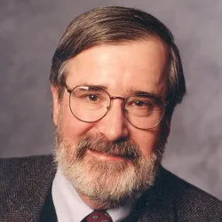
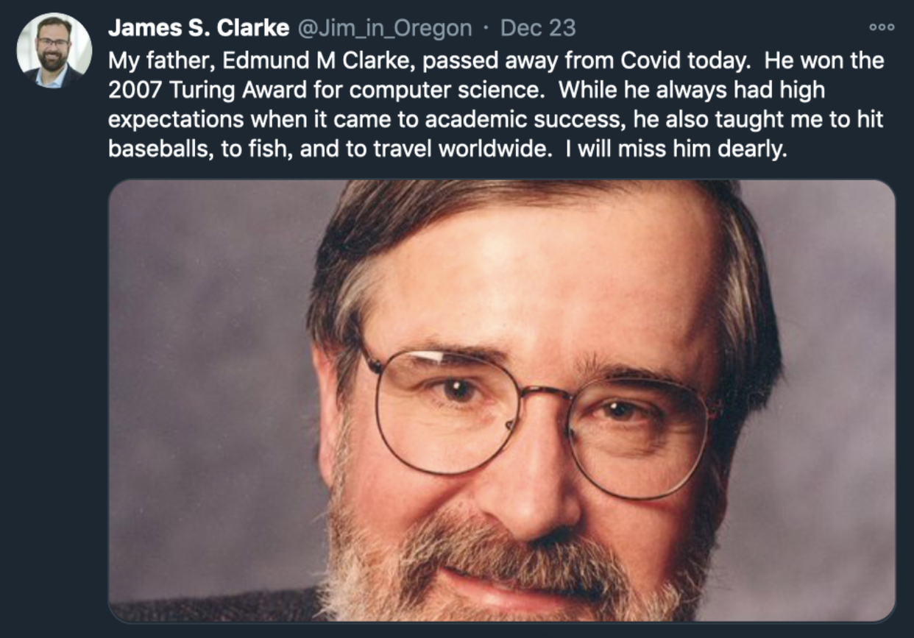

爱德蒙·克拉克（Edmund Melson Clarke，1945年7月27日 - 2020年12月22日），美国计算机科学家，致力计算机硬件系统形式验证研究，2007年图灵奖得主之一。

爱德蒙·克拉克出生于1945年7月27日，美国弗吉尼亚州纽波特纽斯市，他是家中第一个大学毕业的人。他最初学习数学，1967年获得弗吉尼亚大学学士学位，1968年获得杜克大学硕士学位。随后进入康奈尔大学攻读计算机科学博士学位，导师是将数理逻辑与计算机深层联系起来的先驱「罗伯特·康斯特布尔」，他的博士论文题目是《Completness and Incompleteness Theorems for Hoare-Like Axiom Systems》，翻译成中文是《霍尔式公里系统的完备性与不完备性定理》。

博士毕业后，克拉克在杜克大学任教。1978年转至哈佛大学。1982年，克拉克加入卡内基梅隆大学。1995年，克拉克成为卡耐基梅隆大学首位「FORE Systems」讲席教授。克拉克于2008年被授予大学教授称号，于2015年成为名誉教授。

模型检查是一种用于机器验证硬件、软件、通信协议及其他复杂计算系统的数学模型的房啊发。该技术用于形式验证系统可能达到的所有状态，即使状态数量看似不可能--例如，超过宇宙中可观测到恒星的数量。

克拉克教授开创了模型检测研究领域，并引领其发展，提出了一系列新的理论、方法和技术，在模型检测的众多分支中都做出了奠基性的贡献。

中国计算机学会的文章 [纪念图灵奖获得者Clarke教授](https://mp.weixin.qq.com/s?__biz=MjM5MTY5ODE4OQ==&mid=2651486469&idx=1&sn=3e01c99a4b70c54fd6a6f54fcace809b&chksm=bd4f45678a38cc7125062cb6b547dab39c4eb0d9f04b70c3ce8f4b2ce5d9aaa5c7aac4ae7e9a&scene=27) 对克拉克教授在1981年、1990年、2000年、2001年发表的论文做了专业的总结。

> 我从来不喜欢飞行，虽然我也试过不少。我想做一些能让飞机等系统更安全的事情。

2020年12月22日，克拉克死于 COVID-19，享年75岁。12月23日，英特尔实验室量子硬件研究组总监 James S. Clarke 在社交媒体发文纪念他的父亲。

## 参考资料
1. [百度百科-爱德蒙·克拉克](https://baike.baidu.com/item/%E7%88%B1%E5%BE%B7%E8%92%99%C2%B7%E5%85%8B%E6%8B%89%E5%85%8B/10685445?structureClickId=10685445&structureId=ced913fd22dfe016c93805da&structureItemId=8a797c6ede2cda2ee1e2b429&lemmaFrom=starMapContent_star&fromModule=starMap_content&lemmaIdFrom=324645)
2. https://amturing.acm.org/award_winners/clarke_1167964.cfm
3. https://www.britannica.com/biography/Edmund-Melson-Clarke-Jr
4. https://cacm.acm.org/news/edmund-m-clarke-1945-2020/
5. https://baijiahao.baidu.com/s?id=1686936413201792987&wfr=spider&for=pc